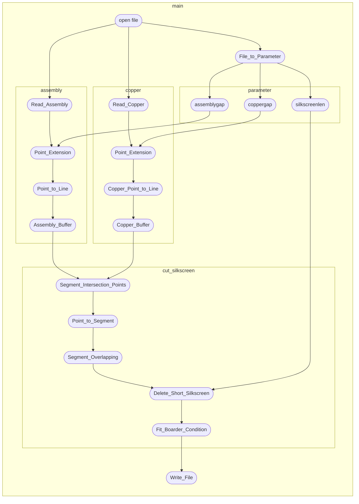

# ICCAD Contest 2022 Problem E

## !!!TODO(NOT_DONE)

BUGsss

- [x] 左中絲印與銅箔計算時會發生錯誤
- [x] 多出多餘的絲印，右上兩線段未切割 (剩餘一圓弧)
- [x] debug scorer fourth quarter
- [x] Scorer "Read_Silkscreen" 在CaseA會重複最後一個silkscreen
- [x] Case C 少一線段 (fixed at 7/22, accuracy problem)

---

- [x] 絲印與銅箔焦點 圓弧對直線 圓弧對圓弧
- [x] copper 外擴 與 絲印交點 arc & line, arc & arc intersection points
- [x] copper 切割絲印，再與silkscreeen相減 (差point的sorting, main.cpp:827)
- [x] 圓與直線交點斜率
- [x] 外擴圓心
- [x] 大於180度之Segment尚未完成
- [x] 完成Scorer第三部分
- [ ] 一個凹陷過於尖，會導致崩潰(兩點外擴皆在assembly內，無結果)
- [ ] 絲印外擴，如無結果，push_back原始assembly point的值
- [ ] 製作Segment版本intersection()
- [x] Arc 修正, Copper需正確運作
- [x] 判斷assembly極值是否被silkscreen覆蓋，並滿足題目要求
- [ ] point_in_polygon() 先判斷點是否在arc極值內，再使用arc_points for迴圈，減少run time
- [ ] Delete_Short_Silkscreen() fit_boarder_condition() 執行順序不明
- [ ] 可偷線段 減少長度 減少數量差異 第二部分拿高分

low priority:

- [ ] Find_Continuous_Segment 可記錄連續線段的開頭位置，節省資料用量
- [x] vector[i] 可用 .at(i)
- [x] 評分器
- [x] 優化圓弧外擴
- [ ] 自主產生題目程式
- [ ] 分class
- [ ] vector 換成 list
- [x] makefile
- [ ] inputoutput 的 Dot 與 Scorer 的 dot 功能重複
- [ ] silkscreen_cut_single_copper 可用於判斷 Assembly 是否被 Silkscreen 切割(更名)
- [ ] silkscreen_cut_single_copper 可利用極值排除加速

## I/O

```text
i/o file location: TestingCase folder

naming rule:    test_"NAME".txt    test_"NAME"_Ans.txt

execution: use "make", regenerate file use "make clean"
```

## Outline

### struct

segment

```C++
bool is_line; // 0 = arc, 1 = line
float x1;
float y1;
float x2;
float y2;
float slope;       //斜率
float y_intercept; //截距
double theta;      // the angle reference to positive x axis
// below is needed by arc, when deals with line set all to 0
float center_x;
float center_y;
bool direction; // 0 = ClockWise(CW), 1 = ConterClockwise(CCW)
double theta_1; // 圓心到點一角度
double theta_2; // 圓心到點二角度
```

Point

```C++
float x;
float y;
bool Next_Arc;
```

Copper

因計算絲印與銅箔交點，需先計算銅箔極值

```C++
float x_min;
float x_max;
float y_min;
float y_max;
vector<Segment> segment;
```

### functions



```C++
float File_to_Parameter(const string); // 匯入三個絲印參數
// dependency: none

const vector<string> split(const string &, const char &); // 將匯入文字分解
// dependency: none

segment String_to_Line(const string); // 將文字轉換為struct segment
// dependency: split()

vector<segment> Read_Assembly(fstream &); // 將Assembly讀入
// dependency: String_to_Line()

vector<vector<segment>> Read_Copper(fstream &); // 將Copper讀入
// dependency: String_to_Line()

vector<Point> Line_to_Point(const vector<segment>); //將線段切割成點
// dependency: none

vector<Segment> Assembly_Buffer(const vector<Segment>); // 繪製絲印
// dependency: Point_Extension(), Point_to_Line()

vector<Copper> Copper_Buffer(const vector<vector<Segment>>);
// dependency: Point_Extension(), Copper_Point_to_Line()

vector<Point> Point_Extension(const vector<Segment>, const bool);
// dependency: Line_to_Point(), point_in_polygon(), Arc_Optimization()

vector<Segment> Point_to_Line(vector<Point>, vector<Segment>);
// dependency: none

Copper Copper_Point_to_Line(vector<Point>, vector<Segment>);
// dependency: Arc_Boundary_Meas()

float interpolate_x(const float, const Point, const Point);
// dependency: none

bool point_in_polygon(const Point, const vector<Point>, const vector<vector<Point>>);
// dependency: interpolate_x()

void Write_File(const vector<segment>); //匯出
// dependency: none

vector<Point> Arc_to_Poly(segment);
// dependency: none

vector<vector<Point>> Arc_Optimization(const vector<segment>);
// dependency: Arc_to_Poly()

Copper Arc_Boundary_Meas(Segment);
// dependency: none

int main(); // 主程式
```

## OOD (Object-Oriented Design)

2022/7/31

finish class Buffer

Peter

---

2022/7/27

finish class FileIO

Peter

---
---

## Algorithms

2022/7/22

fix bugs in boarder condition, case c satisifies the needs, not sure other cases will or not pass the boarder condidition.

Peter

---

2022/7/19

working on boarder condition, done, not tested

three new function

```test
vector<vector<Segment>> fit_boarder_condition()

vector<vector<Segment>> Add_Excess_Silkscreen_For_Boarder_Condition()

float Calculate_Silkscreen_length()
```

Peter

---

2022/7/16

working on boarder condition

Peter

2022/7/4

add Arc features for Sorting, still not finished.

Gray

---

2022/7/2

new function, may be redundant

```text
Arc_Boundary_Meas_for_Assembly()
```

revise flow chart, add new functions to current process

add x, y min max values to every assembly segment, tring to fix the last arc bug

debug

upper two lines correction, see comparison in discord

one arc error left

Peter

---

2022/7/1

debug

generate case c pic success

still have some small bugs

21:00

fix one bug (left-middle excess arc)

Peter

---

2022/6/30

debug

add detail in intersection_between_arc_and_arc(), Point_Inside_Arc()

revise intersection_between_arc_and_arc()

***note: still can not run Case C***

---

Peter

2022/6/28

debug, case c still has bugs

new functions

```text
vector<Point> intersection_between_line_and_arc(Segment, Point, Point);

vector<Point> intersection_between_arc_and_arc(Segment, Segment);

bool Point_Inside_Arc(float, float, float);
```

copyright:

intersection_between_line_and_arc()
<https://stackoverflow.com/questions/1073336/circle-line-segment-collision-detection-algorithm>

intersection_between_arc_and_arc()
<https://stackoverflow.com/questions/3349125/circle-circle-intersection-points>

Peter Macoto Gray Raymond

---

2022/6/11

correct solution of Case_A & Case_B

working on cut silkscreen by copper, kill a lot of bugs.

fit silkscreen to correct output format, delete short silkscreen.

Change the Segment_Sort  judgement from theta to  x1, x2 points

new parameter

```text
Subtraction_Tolerance 0.00005
```

new functions

```text
Find_Continuous_Segment()

Delete_Short_Silkscreen()

Write_File() overload
```

Peter Gray

---

2022/6/10

Add the Segment_Sort  and Point_Sort function for sorting

new functions

```text
Segment_Sort()

Point_Sort()
```

Gray

---

2022/6/9

working on cut silkscreen by copper, mostly done, NEED SORT on main.cpp:827!!!

Peter

---

2022/6/8

making decision on how to cut silkscreen

Peter Macoto Gray

---

2022/6/7

deal with single circle copper, processed with special case.

add new parameter is_assembly to Point_Extension(), to identify the segment vector is assembly or copper and switch between assemblygap and coppergap.

peter

---

2022/6/4

new parameter

```text
ARC_TO_LINE_SLICE_DENSITY: 幾度取一次點
```

new struct

```text
Copper 包含上下左右邊界
```

new functions

```text
Arc_Boundary_Meas()

Copper_Point_to_Line()

Copper_Buffer()
```

struct change name

```text
segment -> Segment
```

function change name

```text
Buffer -> Assembly_Buffer
```

revise Arc_to_Poly

Peter Macoto

---

2022/6/2

add comment to improve readability

implement Arc_to_poly() into other functions

suggestion: Arc_to_poly() can return vector of points, the vector includes start point and end point

Peter

---

2022/6/2

function

```text
Arc_to_Poly (finish!!!!)
```

help me to run the PublicCases to check if it successes, plz.

Macoto

---

2022/6/2

new function

```text
Arc_to_Poly (not finish!!!!)
```

last point access

Macoto

---

2022/6/1

silkscreen successfull printed, same as copper expansion

new function

```text
interpolate_x()
    
point_in_polygon()
```

use them to correct the point in polygon judgement

copyright: <https://web.ntnu.edu.tw/~algo/Polygon.html>

Peter Raymond Macoto

---

2022/5/27

start processing arc, have some issue.(see test_A pic)

Peter Raymond

---

2022/5/26

fix the bugs in functions, still some weird bugs to go on. (a point is not correct)

change function

```text
Outside_of_Assembly() return type from Point to bool
```

add parameters

```text
Angle_Tolerance = 0.1

PI = pi
```

Peter

---

2022/5/25

new function

```text
Assembly_Line_to_Point()
```

change data structure from lines to points

Peter

---

2022/5/24

new function

```text
Print_Silkscreen(), Outside_of_Assembly()
```

Peter

---
---

## File Processing

2022/7/9

makefile generated

can process multiple testcase

Peter

2022/6/1

visualizer input update, show the file list in the folder, easier to understand how to use

Peter

---

2022/5/29

new functions

```text
String_to_Line()

Read_Assembly()

Read_Copper()

propose: migrate input into functions
```

change name function

```text
File_to_String() -> File_to_Parameter()
```

class Segment Abandoned

Peter

---

2022/5/25

new function

```text
Write_File()
```

can output the txt in correct format

Peter

---

2022/5/21

create new class

```text
Segment 

replace the struct segment
```

Peter

---

2022/5/20

create new function

```text
File_to_String(string str)
```

use as processing the parameter of the silkscreen

Peter

---

2022/5/14

finished reading copper with 2 dimention vector.

merge read data of assembly with copper.

Macoto

---

2022/5/10

finished reading assembly.

new function:

```text
const vector<string> split(const string& str, const char& delimiter)
```

Macoto

---

2022/5/9

Start processing of the file, finished three specs of silkscreen, working on reading assembly.

```text
assemblygap : float, parameter passed by problem

coppergap : float, parameter passed by problem

silkscreenlen : float, parameter passed by problem

segment : struct, include lines and arcs

assembly : vector<segment>, store the assembly details
```

Peter

---
---

## Optimization

2022/8/14

success generate case 1 solution, arc tuning has problems for point failed

Peter

---

2022/7/24

create struct and parameter file

split functions into four classes

discuss some issues to avoid errors and improve runtime

Peter Macoto Gray

---

2022/7/24

unified the output of the four parts of scorer

ShowDetail in scorer work as intended

add arc & arc point tuning in class inputoutput

Peter

---

2022/7/22

fix case c missing line at left-bottom corner

Peter

---

2022/7/19

fix the third part scorer

2022/7/18

fixing arc too close to assembly, still have to deal with coppers and arc & arc

new function

```text
Arc_Point_Tuning()
```

Peter

---

2022/7/12

debug scorer part 2

Peter

---

2022/07/09

finish fourth quarter second and third part, fourth part ongoing

create third quarter

Raymond

---

2022/07/05

Start coding scorer, first quarter

using Shoelace formula to solve area
reference : <https://en.m.wikipedia.org/wiki/Shoelace_formula>,
            <https://www.geeksforgeeks.org/area-of-a-polygon-with-given-n-ordered-vertices/>

create inputoutput.h, containing some fuctions in main.cpp, for scorer.

Raymond

---

2022/07/05

finish first quarter, using law of cosine and heron formula, untesting

Raymond
